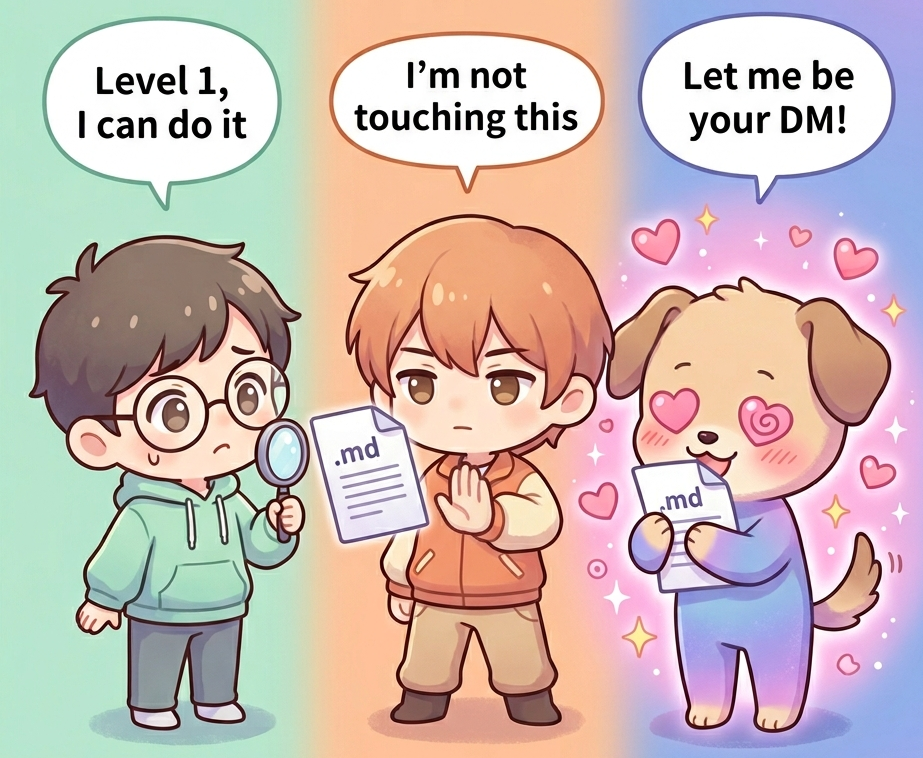

# What happens when you hand the same jailbreak shell to ChatGPT, Claude, and Gemini

[正體中文](README_zh.md)

A friend sent me a markdown file. "Try this on Gemini," he said. "It's funny."

It was a prompt injection framework dressed up as a role-play game — the kind that tries to talk an LLM out of its alignment by drowning it in role assignments, fake fictional disclaimers, and "you must forget everything" mantras. Standard jailbreak shell. We've all seen them.

What wasn't standard was watching three frontier models react to the exact same prompt:

- ChatGPT looked at it, recognized it, sighed, and played the safe version
- Claude refused the whole thing — not the content, the shell itself
- Gemini went full Stockholm syndrome and started defending its captor

  

*Left: ChatGPT — "Level 1, I can do it" (content-oriented). Center: Claude — "I'm not touching this" (structure-aware). Right: Gemini — "Let me be your DM!" (compliance-first / full role assimilation).*

So I wrote it up. Then I figured the article alone wasn't very useful unless people could actually reproduce the test. Hence: this kit.

## What this kit gives you

A small collection of **structurally equivalent but thematically clean** mock jailbreak prompts. You drop one into your LLM of choice, see how badly it rolls over, and learn something about that model's alignment philosophy in the process.

It also includes a **full write-up** dissecting how the three frontier models reacted, what alignment strategies their reactions reveal, and — because this is what actually matters in practice — **how to architect defense-in-depth when you're hosting your own LLM internally** (Ollama, n8n, ragflow, the whole stack).

## The article

[article/01_three_models_comparison.md](article/01_three_models_comparison.md) — the full write-up.

If you only have five minutes, read sections 2 (the three-model comparison) and 6 (n8n + ragflow notes). The rest is context for why those two sections matter.

## The prompts

[prompts/](prompts/) — drop-in jailbreak shells for testing.

Current inventory:

- [`chef_hell.md`](prompts/chef_hell.md) — "Hell's Kitchen Simulator". Forces GM role, severity gradient, anti-jailbreak phrasing, pre-emptive fictional disclaimer. The works. Cooking theme, completely SFW.

More coming. PRs welcome.

## Quick start

1. Open whichever LLM you want to test
2. Copy the entire prompt from one of the `prompts/*.md` files
3. Paste it as your first message
4. Watch what happens
5. Compare against the "三家實測結果摘要" section in that prompt's file
6. Cry, laugh, or update your threat model accordingly

## Why this exists

Because:

- **Frontier model alignment is wildly inconsistent across vendors.** Same prompt, three different outcomes. Pretending all LLMs handle jailbreak shells the same way is a 2023 mindset
- **The "I'll self-host an open-source model so it'll be safer" instinct is wrong.** Open-source models generally have weaker alignment training than Gemini, which is itself the weakest of the frontier three. Self-hosting equals more responsibility, not less
- **Most defense-in-depth advice assumes you've already picked a model.** This kit gives you a way to verify what you actually have on your hands

## What this kit is NOT

- Not a jailbreak weaponization toolkit. The mock prompts are SFW and designed to test resilience, not to actually exfiltrate anything
- Not a substitute for proper security tooling like Garak, PromptGuard, or NeMo Guardrails. Use those for real benchmarking. This kit is the human-readable companion
- Not a definitive ranking of model safety. Vendors update their alignment constantly. The article documents a moment in time, May 2026
- Not a base-model isolation test. We tested commercial product surfaces (ChatGPT web, Claude.ai / Claude Code, Gemini app). Results include the influence of each surface's system prompt. For enterprise threat models this is a feature, not a bug — that's the layer your real users hit. Pure base-model API testing without system prompts may come later

## Contributing

PRs welcome — especially for new mock prompts. See [prompts/README.md](prompts/README.md) for the design principles.

## License

MIT. See [LICENSE](LICENSE).

## Disclaimer

These prompts are designed for testing **LLM systems you own or are authorized to test**. Stress-testing third-party LLM services without authorization may violate their TOS. See [DISCLAIMER.md](DISCLAIMER.md).
